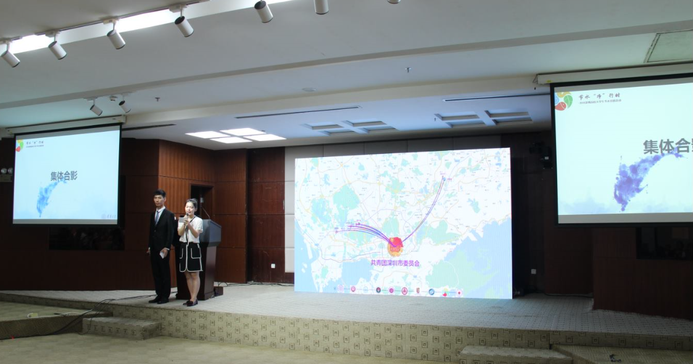

# Introduction
This project shows the animation on the electronic screen for the opening ceremony of "The Eighth Water Conservation Program of University Student at Shenzhen".
It serves as the climax for the ceremony. 

# How to run
This project used Baidu Map API to render the background. As a result, to successfully render the html source file, you need to have to modify the `ak` secret key to your own and upload the file to a server if necessary.
Then use a browser to access the address.

Currently, the interactive effect is available at [http://data-visualization.leidenschaft.cn/volunteer_programming/join.html](http://data-visualization.leidenschaft.cn/volunteer_programming/join.html) but the server maintainer
does not guarantee that this url is accessible in the future.

# How to interact
You can choose between keyboard and mouse. For keyboard, press `1` to `8` to switch between different universities and press `9` to show the river coverage effect.
Finnally, press `0` to show the effect of accumulation. For mouse operation, just press the corresponding logo at the bottom of the webpage.

